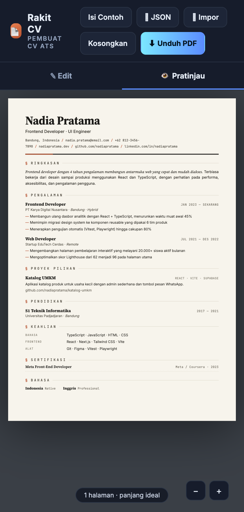
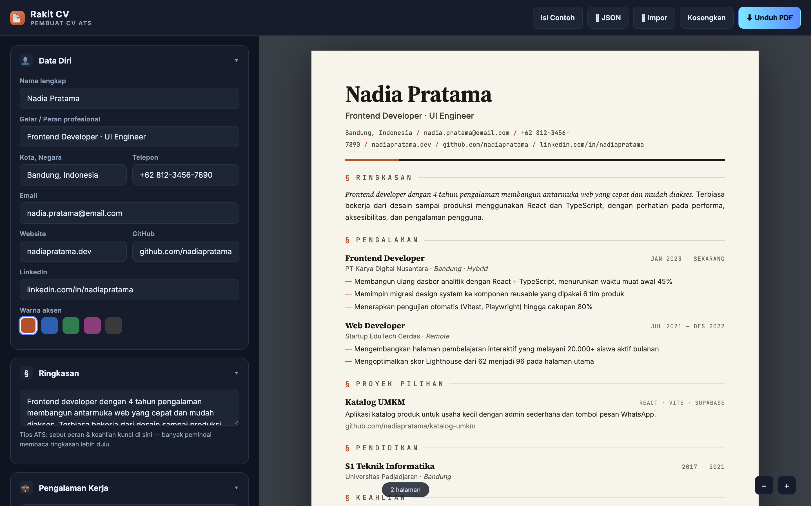
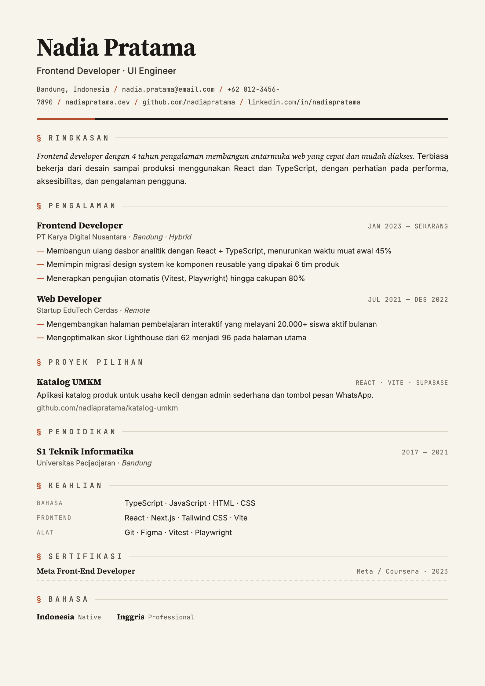
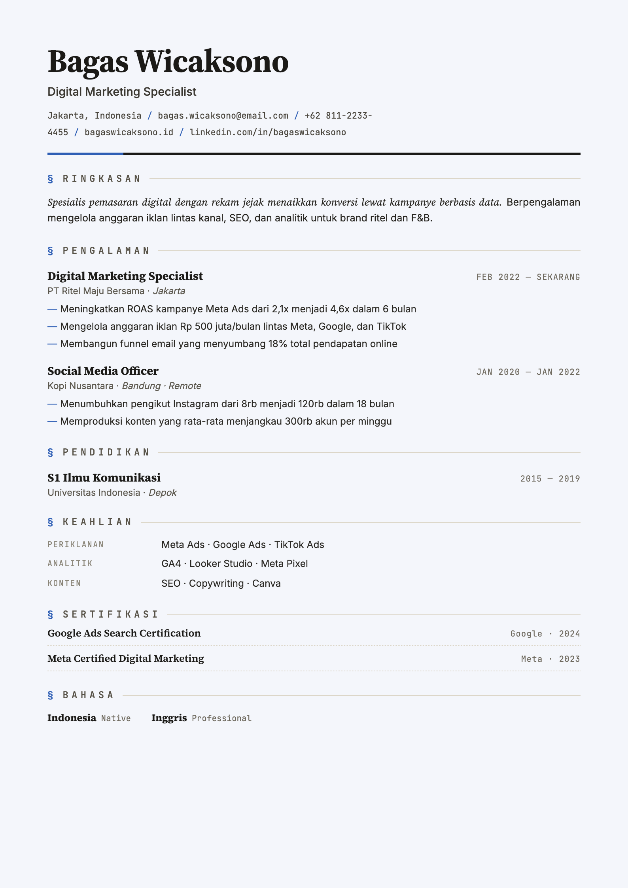

<div align="center">



# 📄 Rakit CV

### Pembuat CV & Surat Lamaran ramah-ATS, gratis, langsung di browser.
Isi form → CV rapi &amp; profesional → unduh PDF berteks asli yang lolos pemindai ATS. Dwibahasa ID/EN, plus generator surat lamaran serasi.

<p>
  <a href="https://resumekita.my.id"><b>🌐 Buka resumekita.my.id</b></a>
</p>

<p>
  <a href="https://resumekita.my.id"></a>
  
  
  
</p>



<sub><i>Editor di kiri, pratinjau A4 real-time di kanan. Semua contoh di halaman ini memakai data dummy.</i></sub>

</div>

---

## 🎯 Kenapa Rakit CV?

Sebagian besar lamaran kerja disaring dulu oleh **ATS** (*Applicant Tracking System*) — perangkat lunak yang membaca CV secara otomatis — **sebelum** sampai ke tangan rekruter. CV yang penuh kolom, tabel, ikon, grafik, dan foto sering **gagal terbaca** dan langsung tersingkir.

**Rakit CV** menghasilkan CV yang disukai mesin **dan** enak dilihat manusia:

- **Satu kolom, judul seksi standar, teks asli** — bukan gambar — jadi mudah diurai ATS.
- **PDF berteks** (bisa disalin & dipindai), bukan hasil tangkapan layar.
- **Desain serif klasik** yang rapi dan berwibawa, dengan aksen warna pilihanmu.

> **Uji cepat ATS:** unduh PDF-mu, buka, lalu blok semua teks &amp; salin-tempel ke Notepad. Kalau semua kata muncul rapi dan berurutan, CV-mu ramah-ATS. ✅

---

## ✨ Fitur

| | |
|---|---|
| ✍️ **Form terpandu** | Data diri, ringkasan, pengalaman, proyek, pendidikan, keahlian, sertifikasi, bahasa |
| ✉️ **Surat Lamaran** | Generator surat lamaran serasi CV — otomatis pakai nama & kontakmu, isi bisa diedit |
| 🌐 **Dwibahasa ID / EN** | Ganti judul seksi &amp; template surat antara Indonesia dan Inggris sekali klik |
| 🧑‍💼 **6 contoh profesi** | Developer, Marketing, Guru, Admin, HSE/K3, Fresh Graduate — data dummy siap ubah |
| 👁 **Pratinjau real-time** | Halaman A4 diperbarui seketika saat kamu mengetik + penghitung jumlah halaman |
| 🎨 **5 warna aksen** | Terakota, biru laut, hijau, plum, grafit — semua tetap ramah-ATS |
| 🔁 **Kelola entri** | Tambah, hapus, dan urutkan tiap pengalaman/proyek dengan sekali klik |
| 💾 **Tersimpan otomatis** | Data tersimpan di perangkat (localStorage); bisa **ekspor/impor JSON** untuk lanjut nanti |
| 🖨️ **Unduh PDF** | Teks asli lewat dialog cetak → *Save as PDF*; nama file otomatis `CV-Nama.pdf` |
| 📱 **Responsif** | Tab **Edit / Pratinjau** di ponsel |
| 🔒 **Privat** | Tidak ada server, tidak ada login — datamu tak pernah dikirim ke mana pun |

---

## 🖼️ Contoh Hasil (data dummy)

Satu desain, cocok untuk berbagai profesi — cukup ganti warna aksen:

<table>
<tr>
<td width="50%" align="center"><b>🟧 Terakota — Developer</b><br></td>
<td width="50%" align="center"><b>🟦 Biru Laut — Marketing</b><br></td>
</tr>
</table>

<sub>Tokoh &amp; isi di atas sepenuhnya fiktif, hanya untuk contoh tampilan.</sub>

---

## 🚀 Cara Pakai

1. Buka **[resumekita.my.id](https://resumekita.my.id)**.
2. Klik **Isi Contoh** untuk melihat gambaran, lalu ganti dengan datamu — atau mulai dari kosong.
3. Isi form; pratinjau di kanan mengikuti otomatis.
4. Pilih **warna aksen** favoritmu.
5. Klik **⬇ Unduh PDF** → pada dialog cetak pilih **Save as PDF** → simpan.

> 💡 Data tersimpan di browser ini. Ganti perangkat? Pakai **⭳ JSON** untuk mengekspor, lalu **⭱ Impor** di perangkat lain.

---

## 🧠 Tips CV ramah-ATS

- Tulis **capaian terukur** (angka, %, jumlah) — satu poin per baris.
- Pakai **kata kunci** dari deskripsi lowongan pada ringkasan &amp; keahlian.
- Simpan **1–2 halaman**; penghitung halaman membantu menjaga panjangnya.
- Hindari foto, ikon berlebihan, dan tabel rumit — Rakit CV sudah menjaganya untukmu.

---

## 🛠️ Teknologi

HTML + CSS + JavaScript **murni** — tanpa framework, tanpa build step, tanpa dependensi runtime. Ekspor PDF memakai **pipeline cetak bawaan browser** sehingga teks tetap asli (kunci agar lolos ATS). Font: *Source Serif 4*, *Inter*, *JetBrains Mono*. Hosting statis di GitHub Pages di belakang Cloudflare.

```
index.html   → tampilan + gaya CV + CSS cetak
app.js       → state, form dinamis, render pratinjau, PDF, simpan/impor
```

## 💻 Menjalankan lokal

```bash
python3 -m http.server 8080     # lalu buka http://localhost:8080
```

---

<div align="center"><sub><b>Rakit CV</b> · dibuat oleh <a href="https://ksatriabintangsamudra.my.id">Ksatria Bintang Samudra</a> · lisensi MIT</sub></div>
